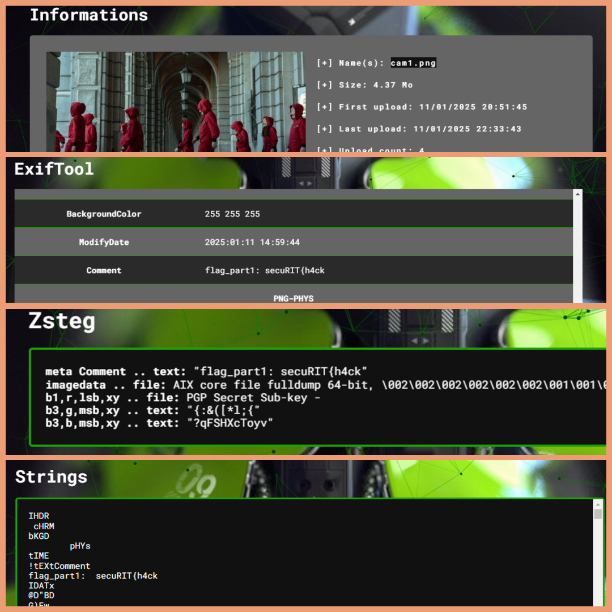
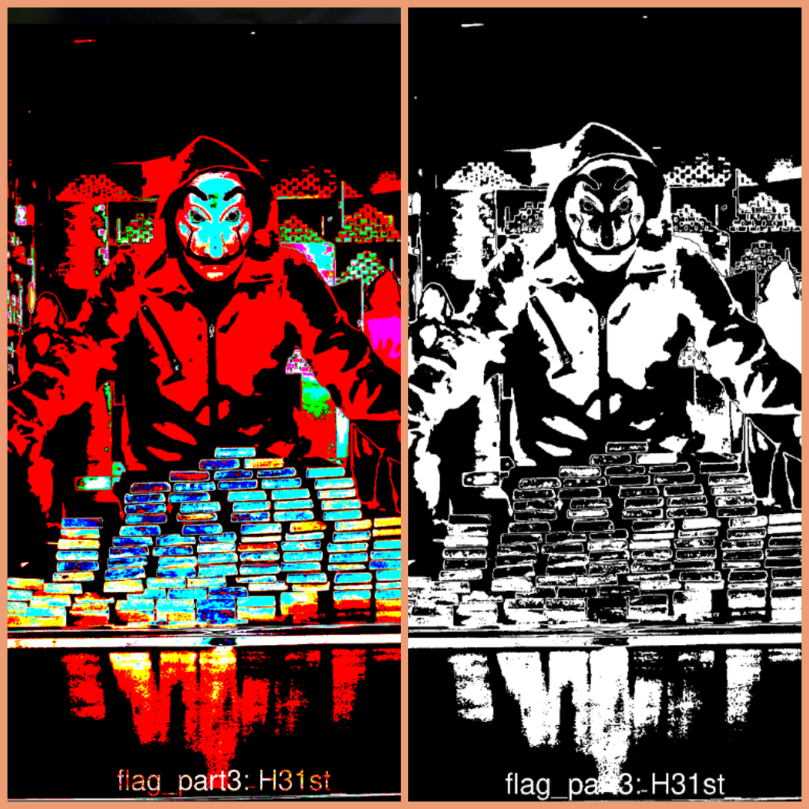
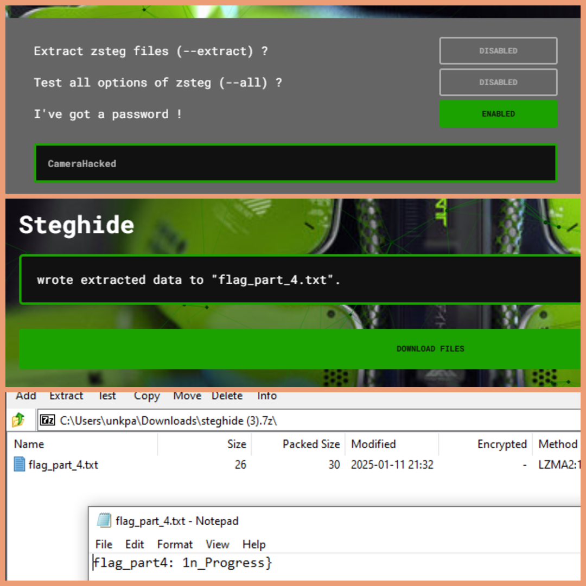

# Solution Guide: Security Cameras Challenge

## **Overview**

This challenge is part of the Money Heist-themed CTF where participants uncover hidden clues across interconnected web pages to recover flag parts and unlock subsequent challenges. The full flag is:

`secuRIT{h4ckRITu4al_H31st_1n_Progress}`

Here, we explain step-by-step solutions for uncovering flag parts and solving the puzzles embedded within the Security Cameras challenge.

---

## **Challenge 1: Retrieving** `flag_part1`

### **Context**

- The first camera feed (`cam1.png`) contains hidden metadata that reveals `flag_part1`.

### **Solution**

1. **Identify Metadata Clues:**

   - Use a tool like `exiftool` to inspect the metadata of `cam1.png`.

   ```bash
   exiftool cam1.png
   ```

2. **Extract the Metadata:**

   - Look for the `Comment` field, which contains:
     ```
     Comment: flag_part1: secuRIT{h4ck
     ```

3. **Answer:**

   - `flag_part1` = `secuRIT{h4ck`

# AperiSolve



---

## **Challenge 2: Retrieving** `flag_part2`

### **Context**

- The second camera feed image (`cam2_route_to_[flag_part2].png`) hints at a dynamic binary puzzle located at `/secret_cameras/flag_part2`.

### **Solution**

1. **Access the Puzzle Page:**

   - Navigate to `/secret_cameras/flag_part2` on the web app.

2. **Solve the Binary Puzzle:**

   - Flip the binary cells in the interactive grid to form the binary number `10101101`.
   - Submit the solution to reveal the next part of the flag and an additional clue for the next challenge.

3. **Output:**

   - Upon correct submission, the alert box reveals:
     ```
     Success! Flag Part 2: _R1Tu4l_

     Secret Quest: Solve the equation in Camera 2 feed to get the route to the next challenge!
     ```

4. **Answer:**

   - `flag_part2` = `_R1Tu4l_`

---

## **Challenge 3: Retrieving** `flag_part3`

### **Context**

- The third camera feed (`cam3.jpg`) contains semi-transparent text revealing `flag_part3`.

### **Solution**

1. **Enhance Visibility:**

   - Use an image manipulation tool like ImageMagick to analyze the image and enhance visibility of the hidden text.

   ```bash
   sudo apt update
   sudo apt install imagemagick
   convert cam3.jpg -pointsize 72 -fill "rgba(255,255,255,0.5)" -gravity center -annotate +0+0 "flag_part3: H31st_" cam3_with_semi_transparent_text.jpg
   ```

2. **Extract the Flag:**

   - The annotation reveals `flag_part3: H31st_`.

3. **Answer:**

   - `flag_part3` = `H31st_`

---
# AperiSolve


## **Challenge 4: Retrieving**`flag_part4`

### **Context**

- The fourth camera feed (`cam4.jpg`) contains an embedded file using steganography.

### **Solution**

1. **Extract the Embedded File:**

   - Use `steghide` to extract the hidden file `flag_part_4.txt`.

   ```bash
   steghide extract -sf cam4.jpg
   ```

   - When prompted for a password, leave it blank or use the given clue.

2. **Read the File:**

   - The extracted file reveals:
     ```
     flag_part4: _1n_Progress}
     ```

3. **Answer:**

   - `flag_part4` = `_1n_Progress}`
# AperiSolve


---

## **Full Flag**

Combine all parts to reconstruct the full flag:

```plaintext
flag_part1: secuRIT{h4ck
flag_part2: _R1Tu4l_
flag_part3: H31st_
flag_part4: _1n_Progress}
```

# Complete Flag: **secuRIT{h4ckRITu4l_H31st_1n_Progress}**---

## **Secret Quest: Solving the Equation**

### **Context**

- Camera 2's feed hints at solving an equation to unlock the route to the next medium-difficulty challenge.

### **Solution**

1. **Equation Analysis:**

   - The equation hinted at in the feed simplifies to coordinates or clues for `/secret_cameras/TheProfessorsCommunications`.

2. **Solve the Equation:**

   - Example equation: `x + y = z`
   - Solve using provided parameters or clues.

3. **Unlock the Route:**

   - Correct solution reveals:
     ```plaintext
     Route to next challenge: /secret_cameras/TheProfessorsCommunications
     ```

---

## **Tools and Commands Recap**
- **Steg Analysis:** `AperiSolve` gives solution for 1st,3rd, and the 5th image (provide password/paraphrase wherever required).
- **Metadata Analysis:** `exiftool`
- **Steganography:** `steghide`
- **Image Manipulation:** `ImageMagick``

This concludes the detailed solution for the Security Cameras challenge. Ensure all tools are installed and accessible before starting the CTF!

